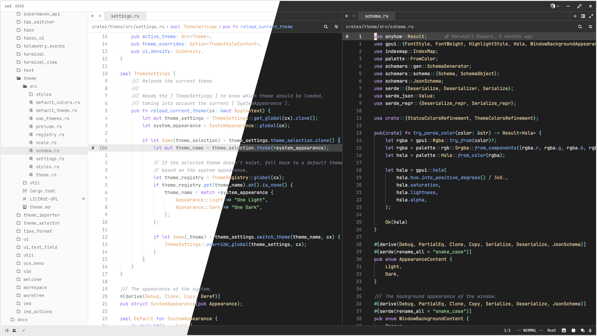

# Adwaita theme for Zed

- UI colors from libadwaita apps (with some tweaks)
- Terminal colors from GNOME Console
- Syntax highlighting from [Catppuccin](https://github.com/catppuccin/zed) Mocha and Latte themes

Screenshot taken using JetBrains Mono font.

## Installation

Hopefully this theme gets added to the official Zed themes, in which case you should be able to just install it as an extension.

Until then, download the repo and copy or symlink `themes/adwaita.json` to `~/.config/zed/themes/`.
